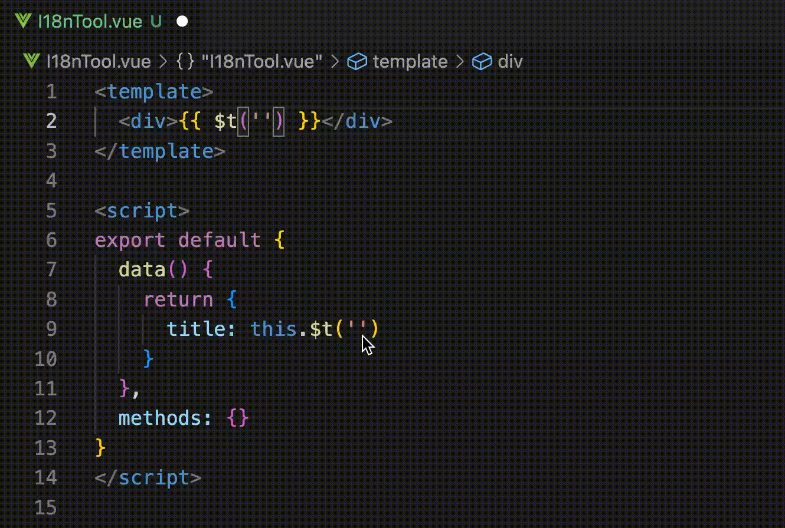

# I18n Tool for VSCode

<p align="center">
  
</p>

<p align="center">
  <a href="https://marketplace.visualstudio.com/items?itemName=kekeqiu.i18n-tool"></a>
  <a href="https://marketplace.visualstudio.com/items?itemName=kekeqiu.i18n-tool"></a>
  <a href="https://marketplace.visualstudio.com/items?itemName=kekeqiu.i18n-tool"></a>
</p>

<p align="center">
  An extension for Visual Studio Code that adds inline annotations and auto completions when calling $t
</p>

<p align="center">
  
</p>

I18n Tool provides additional context of [JetBrains' IDEs style](https://blog.jetbrains.com/phpstorm/2017/03/new-in-phpstorm-2017-1-parameter-hints/) for your internationalized code. By displaying inline internationalized translations, it makes it easier to read complex internationalized keywords; Through code completions, we no longer need to look up the international dictionary.

## Configurations

Click the extension icon  in the lower left corner of the status bar , it will open `.i18ntoolrc` file, the internationalization prompt function can be enabled in the following two ways.

### 1. Specify internationalization file path

Configure `jsonDataPath` as a local absolute path:

```json
{
  "jsonDataPath": "/path/to/data.json",
  "i18nKeys": [],
  "key": "lang_code"
}
```

file `schema`:

```json
{
  "lang.wms.fed.hello": {
    "zh_cn": "你好",
    // ...
  }
}
```
### 2. Configure MySQL database connection

Configure `db` connection information:

```json
{
  "db": {
    "host": "0.0.0.0",
    "username": "readonly",
    "password": "readonly",
    "database": "database",
    "table": "i18n table name"
  },
  "i18nKeys": [],
  "key": "lang_code"
}
```

`db. Host ` supports reading environment variables by specifying the environment variable field: ` db.readHostFromEnv`. 

*For example, in vue projects, specify the environment variable as VUE_APP_BASE_URL*

### Configuration Field Details

| Name | Description |
|------|-------------|
|`jsonDataPath`|Local internationalization file path|
|`db`|MySQL database connection, extension reads remote internationalization data and caches it locally|
|`i18nKeys`|Internationalized list, such as `zh_cn`，`en_us`|
|`key`|Internationalized entry keyword|
|`validateKey`|Internationalized entry validation conditions. Filter the entries used in the front end through `validateKey`|

Example of a complete configuration:

```json
{
  "jsonDataPath": "/path/to/data.json",
  // or
  "db": {
    "host": "0.0.0.0",
    // or
    "readHostFromEnv":  "VUE_APP_BASE_URL",
    "username": "readonly",
    "password": "readonly",
    "database": "database",
    "table": "i18n table name"
  },
  "i18nKeys": [
    "zh_cn",
    "en_us",
    "zh_hk"
  ],
  "key": "lang_code",
  "validateKey": "lang\\.\\w+\\.fed"
}
```

## Settings

The extension provides a handful of configuration settings you can use to customise the look and behaviour of the parameters.

| Name | Description | Default |
|-------|------------|---------|
| `i18n-tool.enabled`  | Toggle inline annotations and auto completions | `true` |
| `i18n-tool.lang`  | Current language | `zh_cn` |
| `i18n-tool.autodownload`  | Auto download when configuration changes | `false` |

There are also a handful of settings that can be used to customise the styling of the annotation to your own personal preference.

| Name | Description | Default |
|-------|------------|---------|
| `i18n-tool.fontWeight` | Annotation styling of font-weight CSS property | `"400"` |
| `i18n-tool.fontStyle` | Annotation styling of font-style CSS property | `"italic"` |
| `i18n-tool.fontSize` | Annotation styling of font size CSS property | `0.85em` |
| `i18n-tool.margin` | Annotation styling of margin CSS property | `0.25em` |
| `i18n-tool.padding` | Annotation styling of padding CSS property | `0.25em 0.5em` |
| `i18n-tool.border` | Annotation styling of border CSS property | `none` |
| `i18n-tool.borderRadius` | Annotation styling of border-radius CSS property | `0.25em` |

## Themable Colours

You can change the default foreground and background colours in the `workbench.colorCustomizations` property in user settings.

| Name | Description |
|------|-------------|
| `inlinetranslation.annotationForeground` | Specifies the foreground colour for the annotations |
| `inlinetranslation.annotationBackground` | Specifies the background colour for the annotations |

## Commands

| Name | Description |
|------|-------------|
| `i18n-tool.toggle` | Enable / Disable i18n tool |
| `i18n-tool.open` | Open i18n tool `.i18ntoolrc` file |
| `i18n-tool.refresh` | Refresh local i18n data |

## Credits / Links

- [VSCode's Extension Samples](https://github.com/microsoft/vscode-extension-samples/tree/master/decorator-sample), which was a huge help to get started
- [Liam Hammett](https://github.com/imliam) for the [Inline Parameters for VSCode](https://github.com/imliam/vscode-inline-parameters) (An extension for Visual Studio Code that adds inline parameter annotations when calling a function.)

## License

The MIT License (MIT). Please see the [license file](LICENSE.md) for more information.
